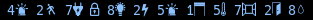
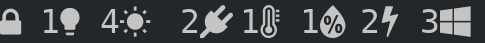
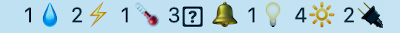
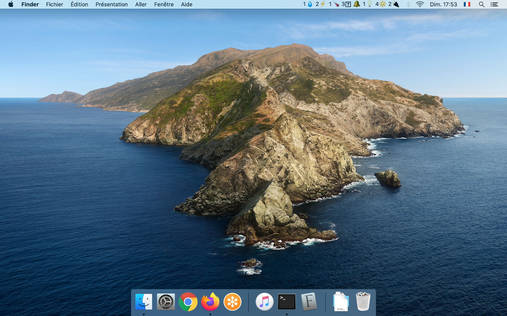
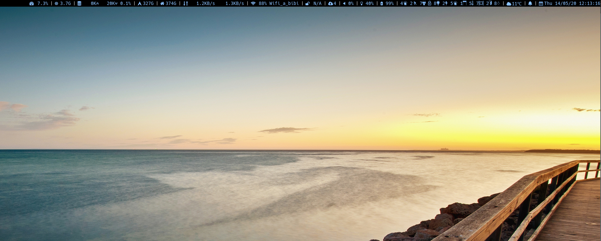

# Jeedom Status 

Jeedom is a third party tool for [Jeedom](https://jeedom.com/) (Home assistant).

It shows the Jeedom global status in the status bars in the global status bar of the operating systems.

You can download the binary directly from the [release page](https://github.com/deimosfr/jeedom-status/releases). It's available for Mac, Windows and Linux.

# Prerequisites

To use jeedom-status, you have to get :
* Your user hash key. Go into Jeedom web interface, then click on Tools -> Preferences -> Security -> User Hash.
* The URL of your jeedom like (replace "jeedom" with the name or IP of Jeedom endpoint): http://jeedom

## Icons (fonts glyphs)

Jeedom Status supports 4 types of visual aspects:
* Text (default)
* Jeedom icons 
* Nerd fonts icons 
* Emojicons 

To support Nerd icons, you need to install Nerd fonts: https://github.com/ryanoasis/nerd-fonts

To have the Jeedom icons, you need to install those custom fonts on your operating system:
* https://github.com/jeedom/core/raw/V4-stable/core/css/icon/jeedom/fonts/jeedom.ttf
* https://github.com/jeedom/core/raw/V4-stable/core/css/icon/jeedomapp/fonts/jeedomapp.ttf
* https://github.com/jeedom/core/raw/V4-stable/core/css/icon/nature/fonts/nature.ttf


# Installation and usage

## Mac OS X




The simplest way to install jeedom-status is to run this command from the Terminal application (will install brew, bitbar and jeedom-status):
```
bash <(curl -Ls https://deimosfr.github.io/jeedom-status)
```
And answers questions (as described in the [prerequisites section](#Prerequisites)):
```bash
--> Enter Jeedom API URL (ex: http://YOUR-JEEDOM-URL):
http://192.168.0.2

--> Enter Jeedom User Hash Key
XXXXXXXXXXXX
```

Finally, the last steps are:
* Open the bitbar application and define a folder to store plugins.
* Move the "jeedom-status.1m.sh" plugin file from your Downloads folder to the bitbar plugins folder you've just defined.

You're done, click on the Bitbar and "refresh all". You'll see your Jeedom global status appearing.

## Linux - i3 and i3blocks



Here is an example with [i3blocks](https://github.com/vivien/i3blocks) for [i3wm](https://i3wm.org/). Add this in your i3blocks.conf:

```ini
[jeedom]
command=~/.config/i3/i3blocks_bin/jeedom_status -k xxx -u http://jeedom --style nerd
markup=pango
interval=60
```

If you want to use jeedom fonts, copy them into ~/.local/share/fonts/ and run:

```bash
fc-cache
```

In i3 config, you'll have to set the fonts in the correct order inside the bar block, like:

```
bar {
        status_command i3blocks -c ~/.config/i3/i3blocks.conf
        font xft:Jeedom, Jeedomapp, Nature, Hack Nerd Font, FontAwesome 10
        position top 
        tray_output "eDP1"
        colors {
            separator #ffffff
        }
}
``` 
