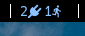

# Jeedom Status 

Jeedom is a third party tool for [Jeedom](https://jeedom.com/) (Home assistant).

It shows the Jeedom global status in the status bars in the global status bar of the operating systems. Here is an example of what can be seen:


# Prerequisites

You need to have specific fonts to get the icons: https://github.com/ryanoasis/nerd-fonts.

# Installation

You can download the binary directly from the [release page](https://github.com/deimosfr/jeedom-status/releases). Download the correct version for:
* Windows
* Mac OS
* Linux

Uncompress the archive to get the "jeedom-status" binary.

# Configuration

To use jeedom-status, you need to have :
* Your user hash key. Go into Tools -> Preferences -> Security -> User Hash.
* The URL of your jeedom API like (replace jeedom with the name or IP of Jeedom endpoint): http://jeedom/core/api/jeeApi.php

Then add those information in the jeedom-status configuration file. Create a file in your Home directory called .jeedom-status.yaml (ex: $HOME/.jeedom-status.yaml).
The content should looks like this:

```yaml
# Add here the user hash
apiKey="user hash"
# Add here the Jeedom API URL
url="http://jeedom/core/api/jeeApi.php"
```

# Usage

## Mac OS X

You need to install [brew](https://brew.sh/). If you don't have this tool, install it this way:
```bash
/bin/bash -c "$(curl -fsSL https://raw.githubusercontent.com/Homebrew/install/master/install.sh)"
```

Once done, you have to install the [Nerd fonts](https://github.com/ryanoasis/nerd-fonts) to get the Fonts containing the icons:
```bash
brew tap homebrew/cask-fonts
brew cask install font-hack-nerd-font
```

Install [bitbar](https://getbitbar.com/) to be able to add jeedom-status in the status bar:
```bitbar
brew cask install bitbar
```

Finally, copy the "jeedom-status" binary to the bitbar plugin folder and name it "jeedom-status.1m.bin".

## Linux - i3 and i3blocks




Here is an example with [i3blocks](https://github.com/vivien/i3blocks) for [i3wm](https://i3wm.org/). Add this in your i3blocks.conf:

```ini
[jeedom]
command=~/.config/i3/i3blocks_bin/jeedom_status
markup=pango
interval=60
```

